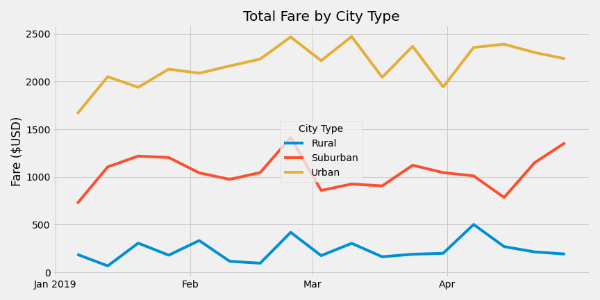

# PyBer Analysis
## Overview of Analysis
<!-- V. Isualize has given you and Omar a brand-new assignment. Using your Python skills and knowledge of Pandas, you’ll create a summary DataFrame of the ride-sharing data by city type. Then, using Pandas and Matplotlib, you’ll create a multiple-line graph that shows the total weekly fares for each city type. Finally, you’ll submit a written report that summarizes how the data differs by city type and how those differences can be used by decision-makers at PyBer. -->
### Project Background
Pyber has been analyszing all the rideshare data from January to early May of 2019, with the intent of improving ride-share access and affordability in under-served neighborhoods. The Pyber CEO, V. Isualize, has specifically requested an analysis by population type (i.e. rural, suburban, and urban).

### Purpose
The purpose of this analysis is to summarize and visualize ride-sharing data by city type, in order to assess how those differences can be used by decision-makers at PyBer.

### Resources
Data Sources:
1. [city_data.csv](Resources/city_data.csv)
2. [ride_data.csv](Resources/ride_data.csv) 

Software: Python 3.7

Analysis Code: [PyBer_Challenge.ipynb](PyBer_Challenge.ipynb)

## Results
<!-- Using images from the summary DataFrame and multiple-line chart, describe the differences in ride-sharing data among the different city types. Ride-sharing data include the total rides, total drivers, total fares, average fare per ride and driver, and total fare by city type. -->
### Summary by City Type
Data has been summarized by rural, suburban, and urban population sizes. From the table below, it is evident that:
- There are more rides and more drivers as population increases.
- The average fare per ride and per driver decreases as population increases, with the disparity more pronounced considering the per driver average. 

|          | Total Rides   | Total Drivers   | Total Fares   | Average Fare per Ride   | Average Fare per Driver   |
|:---------|:-------------:|:---------------:|--------------:|:-----------------------:|:-------------------------:|
| Rural    | 125           | 78              | $4,327.93     | $34.62                  | $55.49                    |
| Suburban | 625           | 490             | $19,356.33    | $30.97                  | $39.50                    |
| Urban    | 1,625         | 2,405           | $39,854.38    | $24.53                  | $16.57                    |

Source: Table generated with [PyBer_Challenge.ipynb](PyBer_Challenge.ipynb), using the data sources in [Resources](#resources) 

Analyzing the weekly fare data in the chart below, totals by city type appear fairly consistent, within a $500 USD spread.  

Source: Chart generated with [PyBer_Challenge.ipynb](PyBer_Challenge.ipynb), using the data sources in [Resources](#resources) 

## Summary
<!-- Based on the results, provide three business recommendations to the CEO for addressing any disparities among the city types. -->
Addressing the disparities among the city types:
- For the **Average Fare per Ride** trend, the cost variations are perhaps due to differences in fare differences.  Further analysis of ride distances and durations is recommended. 
- Considering the **Average Fare per Driver**, the higher average for less populated areas may indicate an insufficient number of drivers.  It is unlcear whether the lower number of drivers is influencing or even driving the similarly lower number of rides.  Analysis of wait times and driver availability at the time of ride requests may reveal if there is a true relationship.
- The correlations above may not be directly linked to city population type, but to another factor such as age.  If so, plans can be developed to appeal to under-served demographics.  In addition to the recommendations above, demographics of the riders should be analyzed to determine any additional correlations. 
